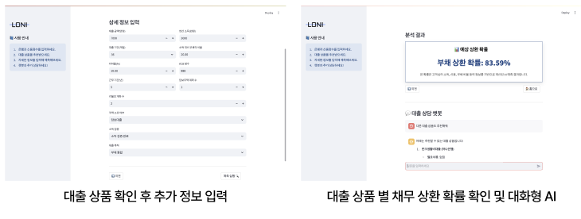

# 대출 모집인을 위한 대출 상품 추천 및 상환 확률 확인 대화형 AI 서비스

### 프로젝트 기간
- 2025년 2월 20일 ~ 2025년 4월 2일
### 참여자
- 박수빈, 이현승, 조누리

### 프로젝트 소개
Lending Club 데이터를 기반으로 대출 상환 확률을 예측하는 모델을 개발하고, LLM과 RAG 구조를 활용해 
사용자 조건에 맞는 대출 상품을 추천하며, 챗봇을 통해 대출 상품에 대한 추가 질의응답이 가능한 대화형 AI 서비스를 구현

### 폴더 구조
```
📁Loan_AI
 ├─ .DS_Store
 ├─ .gitignore
 ├─ README.md
 ├─ preprocessing_final.ipynb
 └─ 📁Project
     ├─ app.py
     ├─ embedding.py
     ├─ rag_model.py
     ├─ 📁chroma_db
     │
     ├─ 📁faiss_db
     │
     ├─ 📁data
     │   ├─ lending_club_data.csv // 대용량 데이터로 git에서는 삭제
     │   └─ credit_loans_final_cleaned.json
     │     
     ├─ 📁pkl
     │   ├─ credit_risk_model_xgb2.pkl
     │   ├─ label_encoders.pkl
     │   └─ xgb_model_grid.pkl
     │
     └─ 📁images
          ├─ streamlit_view1.png
          ├─ streamlit_view2.png
          └─ loni.png

```

<br>

## 기술 스택
1. 분석 툴: Python
2. 사용 라이브러리 및 프레임워크: Pandas, NumPy, Matplotlib, Seaborn, Scikit-learn
MinMaxScaler, RandomForestRegressor, XGBRegressor

<br>

## 데이터 소개
- LendingClub 데이터 (2007~2020Q3, 약 290만 건)
- 뱅크샐러드 크롤링 데이터 (JSON)

<br>

## 데이터 전처리
- 결측치 처리: 10% 이상 결측 컬럼 제거, 나머지는 결측값을 포함한 row 제거
- 문자·범주형 데이터 처리
    - %, "months" 등 문자열 제거 후 숫자형으로 변환
    - 날짜형 변수(issue_d 등)는 경과일수(int) 로 변환
    - 순서형 변수 emp_length는 0~10 정수로 인코딩 
    - 주요 범주형 변수는 One-Hot Encoding 적용
- 다중공선성 및 중복 변수 제거: 수치형 변수 간 상관계수 ≥ 0.9인 변수 제거
- 이상치 처리 및 로그 변환

<br>

## 주요 작업

### 1.대출 상환 확률 예측 모델 구축
- Lending Club 데이터 약 190만 건을 기반으로 대출 상환 여부 이진 분류 모델 개발
- XGBoost, Random Forest, LightGBM 등 다양한 모델 비교 및 성능 평가
- GridSearchCV + 5-Fold CV로 하이퍼파라미터 최적화 수행
- 클래스 불균형 대응을 위해 scale_pos_weight, class_weight 등의 전략 적용
- 최종 모델로 선정된 XGBoost 모델은 F1 Score 0.888의 높은 성능을 달성

### 2. 문서 기반 대출 상품 추천 시스템 설계 (RAG 기반)
- 은행별 신용대출 상품 데이터를 수집 및 가공 후, 상품 단위로 청크 분할
- 사용자 입력 정보를 기반으로 LangChain + FAISS를 활용한 RAG(Retrieval-Augmented Generation) 구조 구현
- 조건 필터링, 중복/대환 제거, 프롬프트 최적화를 통해 최대 3개의 맞춤 상품 추천
- 추천 결과는 LLM 기반 응답으로 사용자에게 자연스럽게 출력

### 3. 실시간 대출 상담형 AI 챗봇 구축 (Streamlit)
- 사용자 정보 입력 → 상품 추천 → 추가 정보 입력 → 상환 확률 예측 → 챗봇 응답 흐름을 Streamlit으로 통합 구현
- LabelEncoder, MinMaxScaler 등을 활용하여 사용자 입력값을 실시간 예측에 적용
- 상환 확률은 Streamlit 화면 내에서 시각적으로 제공
- 대출 상품과 연결된 대화형 응답 제공

<br>

## Streamlit 

### (1) 대출 상품 추천 AI
- 은행선택, 직장 유무, 신용정보 입력받게되면, 입력 받은 정보를 토대로 대출 상품을 추천
<br>


<br>
<br>

  
### (2) 대출 상환 확률 예측 및 대화형 AI
- 추가적인 사용자 정보를 입력받게 되면 대출 상품별 상환 확률을 확인하고 대화형 AI 서비스를 이용 가능
<br>



<br>
